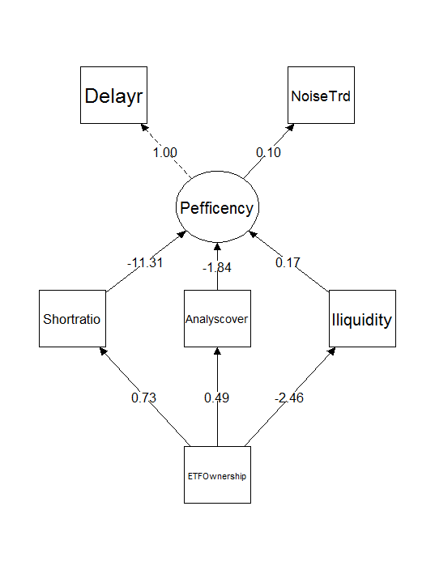

```{r setup, include=FALSE}
knitr::opts_chunk$set(echo = TRUE)
insert<-function(num,fot){
  cftsyle<-fp_text(font.size = 11,bold=FALSE,font.family = "Times New Roman")
  ft<-ifelse(fot=="F",paste("Insert Figure",num),paste("Insert Table",num))
  fpar_2 <- fpar(ftext(ft,cftsyle),
               fp_p = fp_par(padding.top=20,padding.bottom=20,text.align = "center") )
  fpar_2
}

```

```{r echo=FALSE, message=FALSE, warning=FALSE}
library(officer)
library(officedown)
##设置作者姓名
author1="Yingjie Xue"
author2="Changyang Liu"
author3="Yong Wang"
ftsyle<-fp_text(font.size = 14,bold=TRUE,font.family = "Times New Roman")
prop_mod<-update(ftsyle,vertical.align = 'superscript')
fpar_1 <- fpar(ftext(author1,ftsyle),ftext("a*",prop_mod),",",
               ftext(author2,ftsyle),ftext("b",prop_mod),",",
               ftext(author3,ftsyle),ftext("c",prop_mod),fp_p = fp_par(padding.top=23,text.align = "left") )
fpar_1

##设置作者单位
atthinstiution1<-"School of Banking and Finance, University of International Business and Economics, Beijing, 100029, P.R. China."
atthinstiution2<-"Economics and Management School, Chongqing Jiaotong University, Chongqing, 400074, P.R. China."
atthinstiution3<-"School of Securities and Futures, Southwestern University of Finance and Economics, Chengdu, 611130, P.R. China."

ftsyle<-fp_text(font.size = 11,italic=TRUE,font.family = "Times New Roman")
prop_mod<-update(ftsyle,vertical.align = 'superscript')
instfpar_1 <- fpar(ftext("a",prop_mod),ftext(atthinstiution1,ftsyle),fp_p = fp_par(padding.top=20,text.align = "left") )
instfpar_1
prop_mod<-update(ftsyle,vertical.align = 'superscript')
instfpar_2 <- fpar(ftext("b",prop_mod),ftext(atthinstiution2,ftsyle),fp_p = fp_par(text.align = "left") )
instfpar_2
prop_mod<-update(ftsyle,vertical.align = 'superscript')
instfpar_3 <- fpar(ftext("c",prop_mod),ftext(atthinstiution3,ftsyle),fp_p = fp_par(text.align = "left") )
instfpar_3

##设置基金及作者简介

Corrauthorinf<-"Yingjie Xue, E-mail: yingjiexuesuwfe@163.com, Postal address: No.10, Huixin Dongjie, Chaoyang District, Beijing,100029, China, Telephone: 13730829546."
cftsyle<-fp_text(font.size = 11,bold=TRUE,font.family = "Times New Roman")
ftsyle<-fp_text(font.size = 11,font.family = "Times New Roman")
fpar_2 <- fpar(ftext("*Corresponding author:",cftsyle),ftext(Corrauthorinf,ftsyle),
               fp_p = fp_par(padding.top=20,text.align = "left") )
fpar_2

Coauthorinf<-"liuchyang@foxmail.com (Changyang Liu), yong.wang.yong@gmail.com (Yong Wang)"
fpar_2 <- fpar(ftext("E-mail addresses of Co-authors: ",cftsyle),ftext(Coauthorinf,ftsyle),
               fp_p = fp_par(padding.top=20,text.align = "left") )
fpar_2

fundinf<-"This work was financially supported by National Natural Science Foundation of China [grant number 71874145; 71903154]"
fpar_2 <- fpar(ftext("Funding information: ",cftsyle),ftext(fundinf,ftsyle),
               fp_p = fp_par(padding.top=20,text.align = "left") )
fpar_2

```

\newpage

```{r echo=FALSE, message=FALSE, warning=FALSE}
block_section(prop_section(type = "nextPage"))
cftsyle<-fp_text(font.size = 18,bold=TRUE,font.family = "Times New Roman")
fpar_2 <- fpar(ftext(rmarkdown::metadata$title,cftsyle),
               fp_p = fp_par(padding.top=30,padding.bottom=50,text.align = "center") )
fpar_2
```

> **Abstract:** This article uses the degree of noise trading and delay of stock prices as a proxy for pricing efficiency, and studies the impact of ETF ownership on stock pricing efficiency and explores its mechanism. We have three main findings. First, the ETF ownership has a significant impact on pricing efficiency of stock, the stock with high ETF ownership has higher pricing efficiency. Second, ETF ownership mainly affects the pricing efficiency of stock through three channels including transaction costs, short selling restrictions and information mining. ETF ownership not only reduces transaction costs and short-sale constraints, but also attracts more analysts to dig out information, thereby increasing the speed and accuracy which information is incorporated into price. Third, we further decompose the ETF ownership into the parts related to purchase and redemption and revision of ETF component stock, and find that ETF purchase and redemption is a main force to improve pricing efficiency of stock.

> **Keywords:** ETF ownership, pricing efficiency, transaction costs, short-sale restrictions, information mining

# Introduction

Exchange-Traded Fund (ETF) is a financial innovation product. Like a closed-end fund, it can be bought and sold throughout the day on stock exchanges, and like an open-end fund, it allows investors to purchase and redeem. ETFs are favored by investors due to low expense ratios, high level of diversification, and transparency of portfolio. Since the launch of the SSE 50 ETF in the Chinese stock market in 2004, the number and assets size of stock ETFs have been growing rapidly. From 2010 to 2019, the number of stock ETFs has increased from 18 to 243, and the size of assets has increased from 74.658 billion to 851.169 billion RMB (Figure 1)

# Literature Review and Research Hypotheses

This paper studies whether ETF improves pricing efficiency of underlying assets and explores its mechanism. We define pricing efficiency as the degree to which prices reflect all available information in terms of speed and accuracy.

## Literature of Pricing Efficiency

The relationship between securities market information and pricing efficiency has been fully studied in theory, [@mitchell2012]such as effective market theory, financial market noise theory and transaction friction theory. Under the efficient market hypothesis, investors are completely rational, and there is not any restriction on trading, the cost of obtaining information is zero, securities prices can reflect all information in a timely and accurate manner [@barberis2018; @conrad1994], and the pricing efficiency of securities and resource allocation are the best.Discussions about the impact of ETF ownership on pricing efficiency are mainly concentrated [@cochrane2017]，noise traders who traded in individual stock will migrate to ETFs, the departure of noise traders frustrated the enthusiasm of informed traders to gather information about individual stock due to increasing illiquidity and trading costs. [@atmaz2018]。

## Hypotheses Development

Compared with the mature capital market, the Chinese market is special, where the participants are mainly retail investors, and their professionalism and experience are not enough for dealing with challenge in market. In addition, there are prominent problems such as imperfect system construction, excessive speculation, insider trading, and stock price manipulation. So the information asymmetry and trading noise in the market are very serious, which means a low pricing efficiency. After the creation of an ETF, fund companies and other institutions must hold a certain position of ETFs to provide liquidity services for ETFs and maintain the equilibrium between ETF prices and net worth. As a result, institutional investors and retail investors trade ETFs together, bear investment risks. Due to richer professionalism and experience, liquidity services provided by institutional investors is conducive to reducing transaction costs and trading frictions, increasing the speed of stock price incorporating information, and deteriorating the living environment of noise traders. Therefore, the ETF ownership can drive noise traders out of market, and make stock price incorporate information rapidly. Based on the above analysis, we put forward the first hypotheses.

**Hypotheses 1:** Increasing in ETF ownership drive noise traders out of market, and make stock price incorporate information more fast, which means a higher pricing efficiency.

# Data and Empirical Method

## Data Description

In order to study the impact of ETF ownership on the efficiency of stock price and explore its mechanism, this paper selects the ETF constituent stocks traded in the Chinese market from January 2011 to December 2019 as the research sample. After excluding bond ETFs, currency ETFs and cross-border ETFs in the study, there are 188 ETFs and 2,369 stocks in our sample. Research data mainly includes stock trading data, listed company characteristics data, listed company financial report data, ETF constituent stocks weight data, and ETF purchase and redemption data. Among them, the ETF constituent stocks weight data comes from the Tushare financial database, and the rest of the data comes from the CSMAR database. The financial report data of listed companies is quarterly frequency, and the remaining data frequency is monthly frequency.

`r insert(1,"T")`

## Measurement of Variables

### ETF Ownership

ETF ownership of stock i in month t is defined as the sum of the value of holdings by all ETF investing in the stock, divided by the stock's capitalization at the end of the month. It measures the impact of ETF trading activities on the stocks in the ETF basket.

$$
\begin{equation}
  ETFonership=\frac{\sum_{j=1}^{J}{Size_{ij}}\times{w_{ij}}}{Size_{i}}
\end{equation} 
$$ {#eq:eqn1}

$$
\begin{aligned}
  f\left(k\right) = \binom{n}{k} p^k\left(1-p\right)^{n-k} 
\end{aligned}
$$ {#eq:eqn2}

### Pricing Efficiency

[@han2021]defined pricing efficiency as the degree to which stock prices reflect all available information in terms of speed and accuracy. The faster and more accurate the stock prices reflect the information, the higher the pricing efficiency. Therefore, we measure the pricing efficiency from two aspects of speed and accuracy.

`r insert(2,"T")`

# Empirical Results and Analysis

## Descriptive Statistics

Table 2 contains the descriptive statistical results of the main variables. From the perspective of different measures of pricing efficiency, the mean of each measure is greater than the median. For example, the mean of the Delayr and NoiseTrade are 0.3 and 0.614, respectively. Their median are 0.238 and 0.558 respectively, and the sample distribution is near the left tail.

## ETF Ownership and Pricing Efficiency

Pricing efficiency depends on whether asset prices can reflect value information in a timely and accurate manner. Does ETF ownership help to improve efficiency of stock price? We start by examining whether our proxies of pricing efficiency are related to ETF ownership. The specific model is shown in formula (7).

# Further Research and Robustness Test

## Further Research

We have previously confirmed that ETF ownership can improve the speed and accuracy of stock prices reflecting information by reducing transaction costs, alleviating short-sale restrictions, and encouraging analysts to mine information, thereby improving pricing efficiency. But how does ETF ownership affect stock pricing efficiency through the three channels and what information does the stock price incorporate? Market information, industry information or individual stock information, those still need further empirical analysis.

`r insert(2,"T")`

## Robustness Test

In order to ensure the accuracy and reliability of the conclusions, we test the robustness of the research results from different aspects to ensure that the conclusions are not affected by the choice of variables and methods.

`r insert(3,"T")`

<!---BLOCK_LANDSCAPE_START--->

`r insert(4,"T")`

<!---BLOCK_LANDSCAPE_STOP--->

# Conclusion

This paper uses the data of ETF constituent stocks in China's A-share market from 2011 to 2019 to study the influence of ETF ownership on the pricing efficiency of stock, and explores its mechanism. The article focuses on the impact of ETF ownership on the accuracy and timeliness of stock price incorporating information, and proposes three mediator channels that ETF ownership affect pricing efficiency, including transaction costs, short-sale restrictions and information mining. We further decompose ETF ownership into two parts, one part is related to the purchase and redemption, the other is related to the revision of ETF component stocks, and examine the influence of the ETF ownership related to purchase and redemption and the ETF ownership related to revision of ETF component stocks on pricing efficiency and their influence channels, and discuss which level information ETF ownership help stock price incorporate.

\newpage

```{r echo=FALSE, message=FALSE, warning=FALSE}
block_section(prop_section(type = "nextPage"))
cftsyle<-fp_text(font.size = 14,bold=TRUE,font.family = "Times New Roman")
fpar_2 <- fpar(ftext("References",cftsyle),
               fp_p = fp_par(padding.top=10,padding.bottom=10,text.align = "left") )
fpar_2
```

::: {#refs}
:::

\newpage

```{r echo=FALSE, message=FALSE, warning=FALSE}
block_section(prop_section(type = "nextPage"))
cftsyle<-fp_text(font.size = 14,bold=TRUE,font.family = "Times New Roman")
fpar_2 <- fpar(ftext("Appendix",cftsyle),
               fp_p = fp_par(padding.top=10,padding.bottom=10,text.align = "left") )
fpar_2
```

```{r,fig.cap="gross national product",echo=FALSE , message=FALSE, warning=FALSE,}
barplot(GNP ~ Year, data = longley)
```

\newpage

```{r,fig.cap="Structure Equation",echo=FALSE , message=FALSE, warning=FALSE,}

```

\newpage

```{r echo=FALSE, tab.id = "mytab", tab.cap.style = "Table Caption",tab.cap=" "}
pacman::p_load(startowd,flextable)
sumarydat<-data.frame(vname=c("Trading cost","Lending supply","analyst coverage","Firm size",
                              "Book to market ratio","Price to earnings ratio","Volatility","Return on equity",
                              "Institutional ownership","Moment"),
                    symbosv=c("Illiqudity","Shortratio","Anlysiscover","Size",
                                "BM","Turnover","Volatility","ROE",
                              "Instituhold","Mon"),
                    vdefin=c("The average over month t of absolute daily equity returns divided by dollar volume for firm i（Amihud,2006）",
                             "The ratio of margin balance to market value of equity.",
                             "The ratio of analysts following firm i to all analysts in month t.",
                             "The natural logarithm of firm i’s market value of equity in month t.",
                             "The book-to-market ratio of firm i at the end of month t.",
                             "The price to earnings ratio of firm i at the end of month t",
                             "The standard deviation of firm i’s daily returns over month t.",
                             "The ratio of net profit to book value of equity at the end of quarter t.",
                             "The ratio of total debt to total assets",
                             "The cumulative returns in past 12 month."))


names(sumarydat)=c("Name","Symbol","Definition")
tabname = "Varable definition"
ft<-fatdat(sumarydat,langu="E",tabname=tabname,align = "left")
ft
```

\newpage

```{r echo=FALSE, message=FALSE, warning=FALSE,tab.cap=" "}
fname<-system.file("extdata","table.html",package = "startowd",mustWork = TRUE)
library(flextable)
library(stringi)
library(stringr)
library(officer)


table<-gettable(fname)[c(2:21),]
tabname="Sentiment on Pricing effeciency"
table<-gettable("touqixjies.html")[c(2:21),]
tabname = "Sentiment impact on price efficiency"
notefoot="This table reports average cross-sectional correlations for the standard and size-adapted liquidity measures with average trade size and various bond characteristics. We calculate the logarithm of a bond’s monthly average trade size from TRACE as well as its age and duration.The credit rating is measured as the average across numerical ratings from S&P."
ft<-fmmodel(table,langu = "E",tabname=tabname,notehead=notefoot)
ft

```

\newpage

```{r echo=FALSE, message=FALSE, warning=FALSE,tab.cap=" "}
table<-gettable("touqixjies.html")[c(2:21),]
tabname = "Sentiment impact on price efficiency"
notefoot="This table reports average cross-sectional correlations for the standard and size-adapted liquidity measures with average trade size and various bond characteristics. We calculate the logarithm of a bond’s monthly average trade size from TRACE as well as its age and duration.The credit rating is measured as the average across numerical ratings from S&P."
ft<-fmmodel(table,langu = "E",tabname=tabname,notefoot=notefoot)
ft

```

\newpage

```{r echo=FALSE, message=FALSE, warning=FALSE,tab.cap=" "}
table<-gettable("table3.html")[c(2:16,42:43),]

table<-gettable("touqixjies.html")[c(2:21),]
tabname = "Sentiment impact on price efficiency"
notefoot="This table reports average cross-sectional correlations for the standard and size-adapted liquidity measures with average trade size and various bond characteristics. We calculate the logarithm of a bond’s monthly average trade size from TRACE as well as its age and duration.The credit rating is measured as the average across numerical ratings from S&P."

ft<-fmmodel(table,langu = "E",tabname=tabname,notefoot=notefoot)
ft

```
